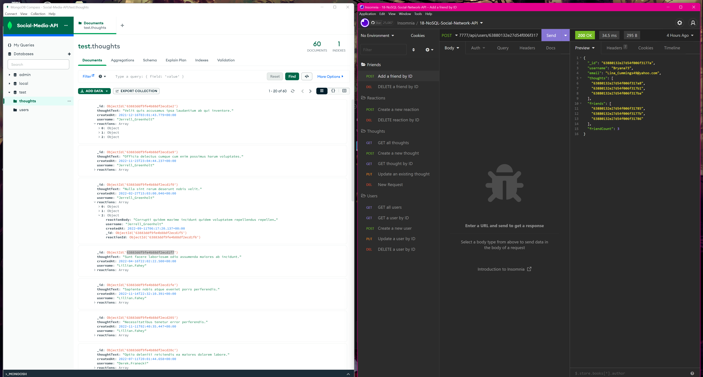

# NoSQL-Social-Network-API

An API for a social network web application where users can share their thoughts, react to friends’ thoughts, and create a friend list.

## Table of Contents 📃

1. [Description](#description)
2. [Screenshot](#screenshots)
3. [Installation](#installation)
4. [Usage](#usage)
5. [Video Walk Through](#video-walk-through)
6. [Technology](#technology)
7. [Features](#features)
8. [Credits](#credits)
9. [License](#license)
10. [Contribution Guidelines](#contribution-guidelines)
11. [Feedback](#feedback)
12. [Socials](#socials)

## Description

I went about creating this application using Express.js for routing and as a general purpose backend framework. More importantly this is the first project that I'm using MongoDB on as non-relational database.

The main aims that I sought to accomplish by creating this application are as follows:

- To create a basic API that can accept HTTP requests to perform CRUD operations on a social media style network.
- An API that can GET data (user data, thought data and reaction data) from the db and present it as JSON
- An API that uses POST, PUT (update) and DELETE HTTP methods and routes to manipulate the data on the db.
- POST and DELETE routes can successfully create and delete reactions to thoughts, as well as add and remove friends.

### User Story 👤

AS A social media startup
I WANT an API for my social network that uses a NoSQL database
SO THAT my website can handle large amounts of unstructured data

### What did I Learn 🏫

Learned a tonne doing this project. Specifically the differences between a relational and non-relational database as well as when and where to use either one. Personally for a social media application I'd prefer to have aspects of the app to have well defined relations (joins). However for this almost blog like network, MongoDB is absolutely fine; especially considering the fact that it's way quicker to build out schemas and scale up horizontally.

Other things I learned:

- Difference between ORM and ODM (structured vs less unstructured schemas)
- Learned how to use faker.js to create fake data
- Cemented knowledge of using environment variables
- Used Day.js to format dates
- Further practiced building REST APIs
- Learned how to better use Mongo Atlas, Mongo Compass and broadened my knowledge of the mongo ecosystem

## Screenshots

## Installation

In order to install this social-network API please follow these steps:

1. Ensure that you have node and npm installed

   - [Download Node](https://nodejs.org/en/download/)

   - For detailed instructions on installing node please follow [this link](https://docs.npmjs.com/downloading-and-installing-node-js-and-npm) for instructions

2. Ensure that you have MongoDB installed

   - [Download MongoDB](https://www.mongodb.com/docs/manual/installation/)

   - [Download MongoDB Compass](https://www.mongodb.com/docs/compass/current/install/) Further note you can decide to install MongoDB Compass to better visualize your data.

   - [Sign-up to MongoDB Atlas](https://account.mongodb.com/account/register?_ga=2.134313463.741469237.1669728820-950435213.1663285573) to host your DB.

3. Clone this repository into your local repository.

   - `git clone git@github.com:TheInfamousGrim/NoSQL-Social-Network-API.git`.

4. Install the dependencies

   - `npm install`

5. Determine whether you want to host your db locally or by using a service such as MongoDB Atlas.

   - Make a copy of your variables.env.example and rename it to variables.env and adjust you variables so that they match up with the port you want the application to run on and the URI for where you with to host the db.

If you've followed these steps correctly then the application should be good to go and can be tested using software like [Insomnia Core](https://insomnia.rest/) 😁

## Usage

Please follow these steps to use the application

1. Seed the db.

   - `npm run seed`

2. Run the following script from your terminal

   - `npm run start`

## Video Walk Through

[Video Link](https://youtu.be/82C95DjOJlI)

## Technology

The technology used for the development of this app was:

[Mongoose](https://mongoosejs.com/)

[faker.js](https://fakerjs.dev/)

[dotenv](https://github.com/motdotla/dotenv#readme)

[day.js](https://day.js.org/)

## Features

- Uses express.js to create and run a server
- Use REST API structure to manipulate data
- Allows user to create, update, get and manipulate user data such as a friend list or users thoughts and reactions

## Credits

🙏 Made with the help of:

- [University of Birmingham Coding Bootcamp](https://www.birmingham.ac.uk/postgraduate/courses/cpd/coding-boot-camp.aspx)

## License

[MIT License](/LICENSE)

## Contribution Guidelines

I'm open to have anyone jump in and contribute just message me on [twitter](https://twitter.com/GrimFunk69)

Please follow the contribution guidelines!
[Guidelines for contributing](/code_of_conduct.md)

## Feedback

Any feedback please email [George Fincher](mailto:george@grimfunky.dev)

## Socials

GitHub: [TheInfamousGrim](https://github.com/TheInfamousGrim)

